# Procédure de debug — bind LDAP/AD

Runbook pour diagnostiquer un échec d'authentification par bind LDAP simple contre Active
Directory — le cas d'une application qui authentifie ses utilisateurs directement contre
l'annuaire (VPN, Wi-Fi RADIUS, appli interne), sans passer par un SSO fédéré.

Toutes les commandes ci-dessous s'exécutent depuis la racine du repo. Remplacez
`DC1.society.local` par votre contrôleur de domaine.

## 0. Avant de commencer — préparer un compte de test

Ne jamais diagnostiquer sur un compte réel : les scénarios ci-dessous désactivent, expirent ou
verrouillent volontairement un compte.

```powershell
$testPwd = Read-Host -AsSecureString -Prompt "Mot de passe du compte de test"
.\New-TestScenarioAccount.ps1 -FirstName "Bind" -LastName "Test" -Password $testPwd -Scenario Disabled
```

(`-Scenario` accepte `Disabled`, `ExpiredAccount`, `ExpiredPassword`, `Locked` — un compte par
scénario ou le même compte réinitialisé entre deux essais, au choix.)

## 1. Identifiants invalides (`data 52e`)

```powershell
.\Test-LdapBind.ps1 -BindDN "btest@society.local" -Password (Read-Host -AsSecureString)
```

**Sortie observée sur ce lab** : `data 52e` → mot de passe incorrect, ou bon compte/mauvais mot de passe.
**Remédiation** : vérifier le mot de passe saisi ; si répété, vérifier que ce n'est pas en fait
un compte verrouillé (voir section 4) qui masque l'erreur réelle sous un message générique.

```powershell
.\Test-LdapBind.ps1 -BindDN "btest@society.local" -Password $testPwd
```

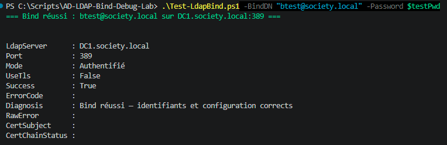

## 2. Compte désactivé (`data 533`)

```powershell
.\New-TestScenarioAccount.ps1 -FirstName "Bind" -LastName "Test" -Password $testPwd -Scenario Disabled
```

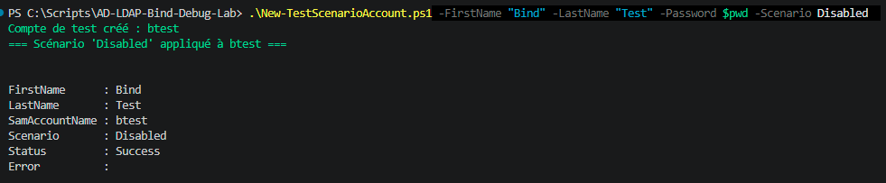

```powershell
.\Test-LdapBind.ps1 -BindDN "btest@society.local" -Password $testPwd
```

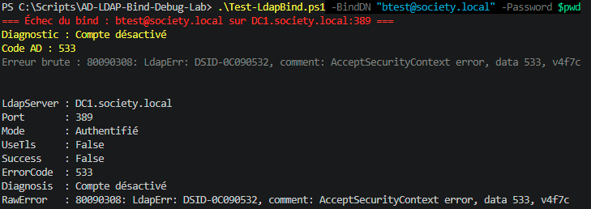

**Sortie observée sur ce lab** : `data 533` → compte désactivé dans l'annuaire.
**Remédiation** : `Enable-ADAccount` si la désactivation n'était pas volontaire.

```powershell
Enable-ADAccount -Identity btest -Server DC1.society.local -Credential (Get-Credential)
.\Test-LdapBind.ps1 -BindDN "btest@society.local" -Password $testPwd
```

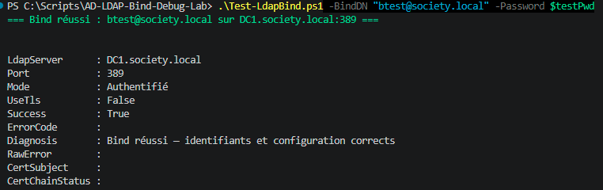

## 3. Compte expiré (`data 701`)

```powershell
.\New-TestScenarioAccount.ps1 -FirstName "Bind" -LastName "Test" -Password $testPwd -Scenario ExpiredAccount
.\Test-LdapBind.ps1 -BindDN "btest@society.local" -Password $testPwd
```

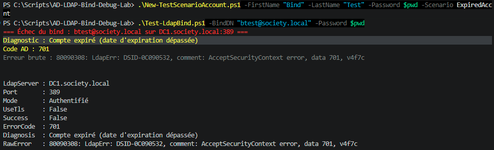

**Sortie observée sur ce lab** : `data 701` → date d'expiration du compte dépassée.
**Remédiation** : `Clear-ADAccountExpiration` ou repousser la date via `Set-ADAccountExpiration`.

```powershell
Clear-ADAccountExpiration -Identity btest -Server DC1.society.local -Credential (Get-Credential)
.\Test-LdapBind.ps1 -BindDN "btest@society.local" -Password $testPwd
```

Bind réussi une fois l'expiration levée (`Success: True`).

## 4. Compte verrouillé (`data 775`)

```powershell
.\New-TestScenarioAccount.ps1 -FirstName "Bind" -LastName "Test" -Password $testPwd -Scenario Locked
```

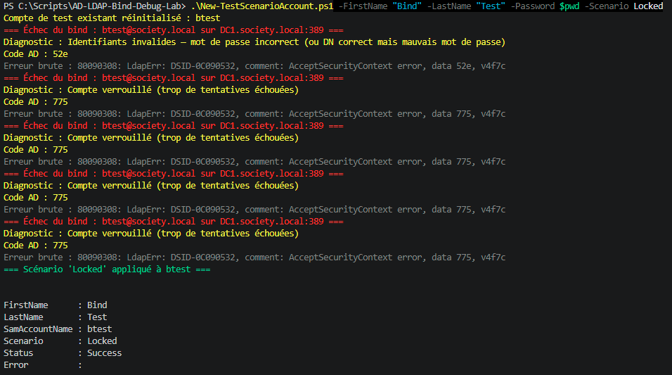

```powershell
.\Test-LdapBind.ps1 -BindDN "btest@society.local" -Password $testPwd
```

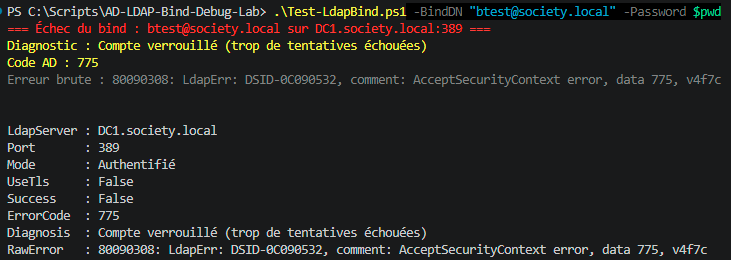

**Sortie observée sur ce lab** : `data 775`, même avec le **bon** mot de passe — c'est la signature d'un
compte verrouillé : contrairement à `data 52e`, l'erreur persiste même après correction du mot
de passe. Sur ce lab, le seuil est de 5 échecs (`LockoutThreshold=5`), déverrouillage
automatique après 30 minutes (`LockoutDuration`).
**Remédiation** : `Unlock-ADAccount -Identity btest` pour débloquer immédiatement, ou attendre
la fenêtre de déverrouillage automatique.

```powershell
Unlock-ADAccount -Identity btest -Server DC1.society.local -Credential (Get-Credential)
.\Test-LdapBind.ps1 -BindDN "btest@society.local" -Password $testPwd
```

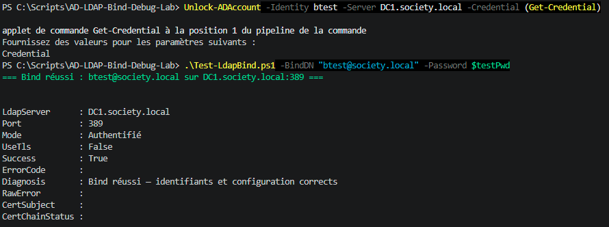

## 5. Mot de passe à changer / expiré (`data 532` ou `773`)

```powershell
.\New-TestScenarioAccount.ps1 -FirstName "Bind" -LastName "Test" -Password $testPwd -Scenario ExpiredPassword
.\Test-LdapBind.ps1 -BindDN "btest@society.local" -Password $testPwd
```

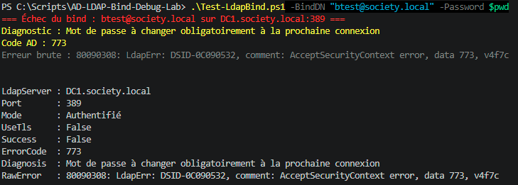

**Sortie observée sur ce lab** : `data 773` (le code exact peut varier selon le contexte —
`532` est l'autre code possible pour ce même type de panne) — un bind simple ne peut pas
changer le mot de passe lui-même, contrairement à une session interactive Windows.
**Remédiation** : forcer un changement de mot de passe via un canal qui le permet
(`Set-ADAccountPassword` côté admin, ou le portail self-service de l'utilisateur).

```powershell
Set-ADAccountPassword -Identity btest -NewPassword $testPwd -Reset -Server DC1.society.local -Credential (Get-Credential)
.\Test-LdapBind.ps1 -BindDN "btest@society.local" -Password $testPwd
```

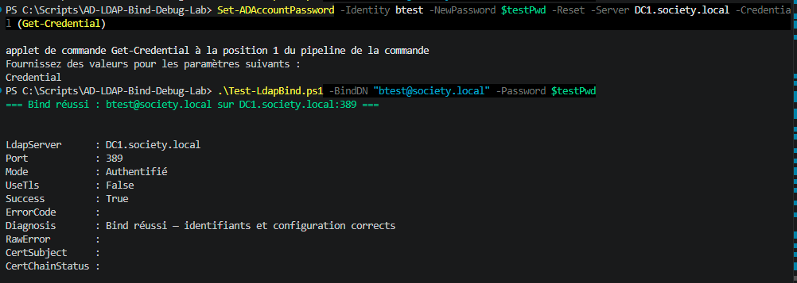

## 6. Bind anonyme et lecture anonyme de l'annuaire

```powershell
.\Test-LdapBind.ps1 -LdapServer DC1.society.local -CheckAnonymous
```

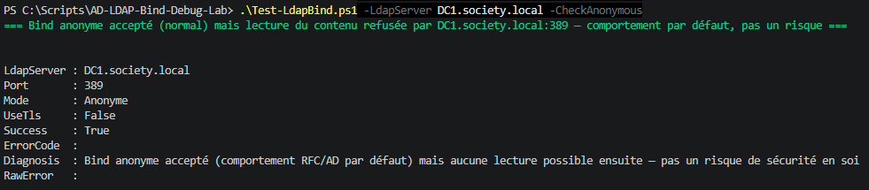

Un bind anonyme qui **réussit** est le comportement par défaut du protocole LDAP/AD (RFC 4513)
— ça ne veut rien dire en soi. Le script tente ensuite une recherche réelle dans l'annuaire
avec cette session anonyme : c'est ce résultat-là qui compte.

**Sortie observée sur ce lab (normale)** : bind accepté, mais lecture **refusée** —
comportement par défaut d'AD, pas un risque.
**Sortie qui serait à risque** (pas ce qu'on observe ici) : bind accepté ET lecture
**réussie** — n'importe qui sur le réseau peut alors énumérer le contenu de l'annuaire sans
identifiants.
**Remédiation si lecture possible** : vérifier `dsHeuristics` / les ACL du groupe "Anonymous
Logon" par défaut, restreindre l'accès en lecture anonyme.

## 7. LDAPS non configuré

```powershell
.\Test-LdapBind.ps1 -BindDN "btest@society.local" -Password $testPwd -UseTls
```

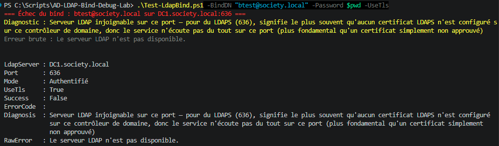

**Sortie observée sur ce lab** : "serveur LDAP indisponible" sur le port 636, pas une erreur de
certificat — ce DC n'a aucun certificat LDAPS configuré (déjà documenté dans
[LDAP-App-Role-Audit](https://github.com/Anne-LaureS/LDAP-App-Role-Audit)), donc le service
LDAPS n'écoute même pas sur ce port. C'est plus fondamental qu'un certificat simplement non
approuvé (où le port répondrait, avec une négociation TLS qui échouerait ensuite sur la
confiance) — les deux symptômes se règlent différemment, d'où l'intérêt de bien distinguer
"rien n'écoute" de "quelque chose écoute mais le certificat n'est pas fiable".
**Remédiation appliquée et vérifiée pour de vrai sur ce lab** (pas seulement décrite en
théorie) :

1. **Installer AD CS sur DC1** et le configurer en autorité racine d'entreprise :
   ```powershell
   Install-WindowsFeature AD-Certificate -IncludeManagementTools
   Install-AdcsCertificationAuthority -CAType EnterpriseRootCA -Confirm:$false
   ```
   Le DC obtient alors automatiquement (auto-enrollment) un certificat pour
   `CN=DC1.society.local`, et LDAPS commence à écouter sur 636 — confirmé par
   `Test-NetConnection DC1.society.local -Port 636` (`TcpTestSucceeded: True`) et par une
   négociation TLS brute réussie (`SslStream.AuthenticateAsClient`).

2. Une fois le port ouvert, `Test-LdapBind.ps1 -UseTls` renvoyait encore un message générique
   au lieu du vrai motif — deux bugs dans le script de validation du certificat, corrigés (voir
   l'historique Git pour le détail). Le diagnostic est alors devenu précis : `PartialChain` —
   chaîne de certificat non reconnue par ce poste client (l'autorité `society-DC1-CA` venait
   d'être créée, ce poste ne lui faisait pas encore confiance).

3. **Importer le certificat de l'autorité racine sur le poste client** :
   ```powershell
   # Sur DC1 :
   Get-ChildItem Cert:\LocalMachine\My\<thumbprint-de-la-CA> | Export-Certificate -FilePath C:\societyRootCA.cer
   # Transférer le fichier, puis sur le poste client (PowerShell admin) :
   Import-Certificate -FilePath societyRootCA.cer -CertStoreLocation Cert:\LocalMachine\Root
   ```
   `PartialChain` disparaît. Reste alors `RevocationStatusUnknown`/`OfflineRevocation` — cette
   CA fraîchement créée ne publie pas de CRL joignable depuis ce poste.

4. **Choix assumé** : `RevocationMode = NoCheck` dans `Test-LdapBind.ps1` plutôt que de monter
   une infrastructure CRL (IIS + republication) hors sujet pour ce lab — un choix réel et
   courant pour une CA interne à faible enjeu (pas justifié pour une CA publique).

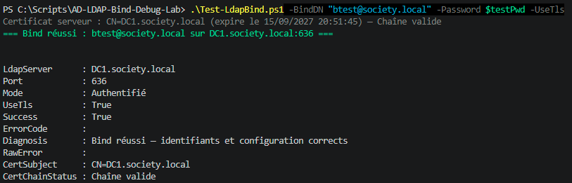

## 8. Mauvais format de DN

```powershell
.\Test-LdapBind.ps1 -BindDN "btest" -Password $testPwd
```

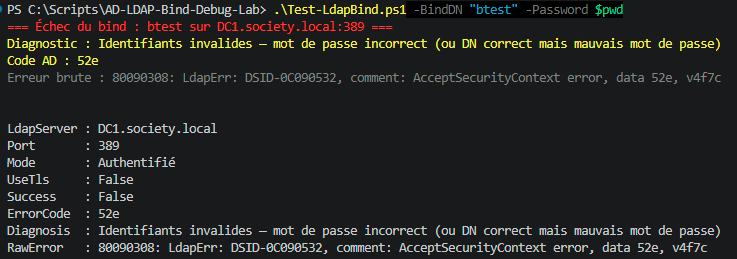

**Sortie observée sur ce lab** : `data 52e` (mauvais mot de passe), pas `data 525` (utilisateur
introuvable) comme on pourrait s'y attendre en passant un `sAMAccountName` nu au lieu d'un UPN
ou d'un DN complet — le client LDAP .NET/Windows semble résoudre implicitement ce nom via le
contexte d'authentification intégré même avec un bind de type `Basic`, masquant l'erreur de
format attendue. Résultat instructif en soi : **on ne peut pas se fier au code d'erreur seul
pour diagnostiquer un problème de format de DN** sur un client Windows — le comportement varie
selon l'implémentation du client LDAP utilisé par l'application (toutes ne font pas cette
résolution implicite).
**Remédiation** : vérifier le format de DN réellement attendu par l'application concernée
(`user@domaine`, `DOMAINE\user`, ou DN complet `CN=...,OU=...,DC=...`) dans sa propre
documentation plutôt que de se fier au code d'erreur renvoyé — c'est la panne la plus fréquente
lors du branchement d'une nouvelle application sur l'annuaire, mais son diagnostic dépend du
client LDAP de cette application, pas d'un code universel.

```powershell
.\Test-LdapBind.ps1 -BindDN "btest@society.local" -Password $testPwd
```
